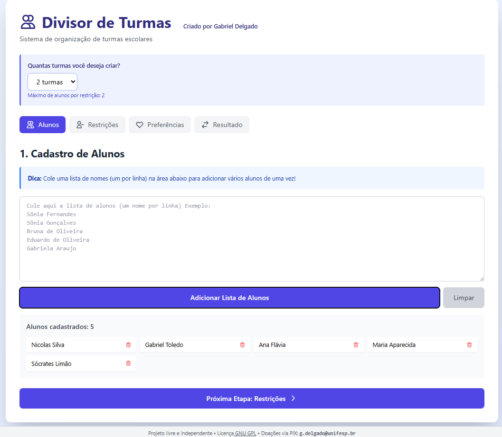
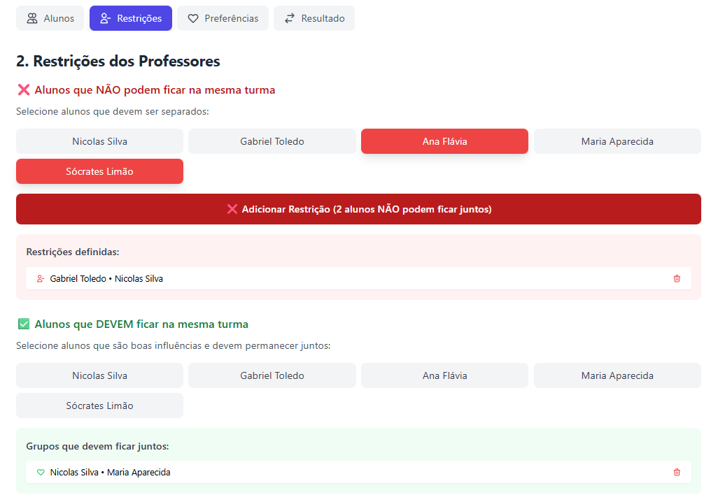
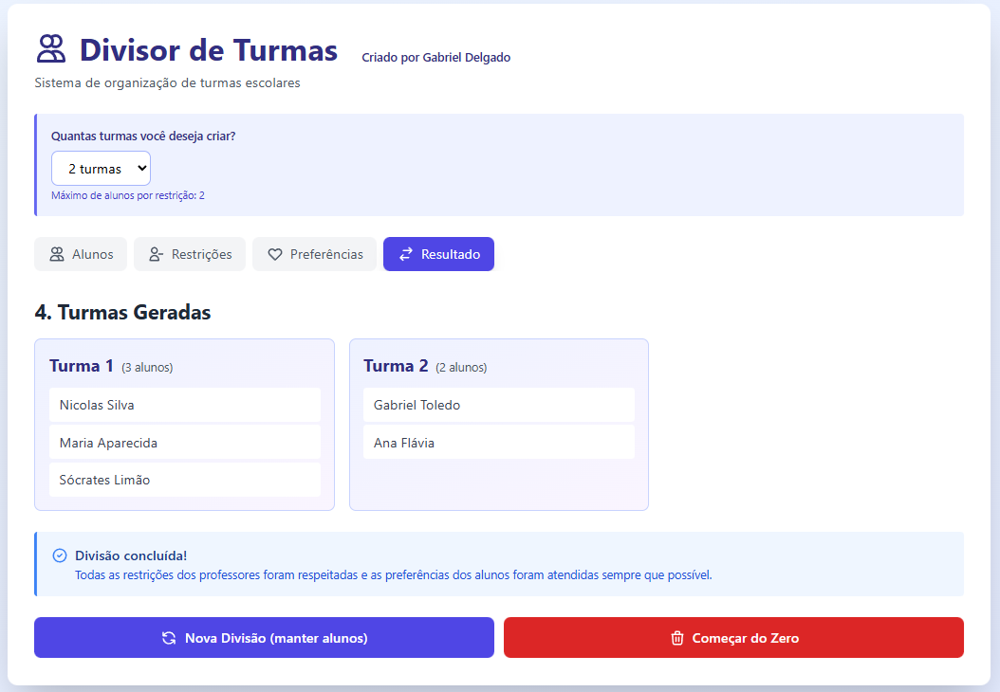

# 📚 Divisor de Turmas Escolar

Sistema inteligente de organização e divisão de turmas escolares que respeita restrições pedagógicas e preferências dos alunos.


## 🎯 Sobre o Projeto

O **Divisor de Turmas** é uma ferramenta desenvolvida para auxiliar instituições de ensino na tarefa complexa de organizar turmas de forma equilibrada e pedagogicamente adequada. O sistema permite que professores definam restrições (alunos que não podem ficar juntos) e grupos que devem permanecer unidos, além de considerar as preferências dos próprios alunos.

### ✨ Características Principais

- 🎓 **Interface Intuitiva**: Design limpo e fácil de usar
- 🔴 **Restrições Pedagógicas**: Define alunos que NÃO podem ficar na mesma turma
- 🟢 **Grupos Positivos**: Mantém juntos alunos que são boas influências
- 💚 **Preferências dos Alunos**: Cada aluno pode escolher até N amigos
- ⚖️ **Equilíbrio Automático**: Distribui os alunos de forma equilibrada entre as turmas
- 🧮 **Detecção de Conflitos**: Alerta quando restrições são impossíveis de atender
- 📱 **Responsivo**: Funciona perfeitamente em desktop, tablet e mobile
- 🚀 **100% Client-Side**: Nenhum dado é enviado para servidores

## 🖥️ Demo

Acesse a aplicação online: [Link da Demo](https://delg11.github.io/Divisor-de-Turmas/)

## 📸 Screenshots

### Cadastro de Alunos


### Definição de Restrições


### Resultado da Divisão


## 🚀 Como Usar

### Opção 1: Uso Online
Acesse diretamente pelo navegador sem necessidade de instalação.

### Opção 2: Download e Uso Local

1. **Clone o repositório**
```bash
git clone https://github.com/seu-usuario/divisor-turmas.git
cd divisor-turmas
```

2. **Abra o arquivo HTML**
```bash
# No Linux/Mac
open index.html

# No Windows
start index.html
```

3. **Pronto!** O sistema rodará diretamente no seu navegador.

## 📖 Guia de Uso

### 1️⃣ Cadastro de Alunos
- Cole uma lista completa de nomes (um por linha)
- Ou adicione individualmente
- Remova alunos clicando no ícone de lixeira

### 2️⃣ Restrições dos Professores

**❌ Alunos que NÃO podem ficar juntos:**
- Selecione 2 ou mais alunos
- Clique em "Adicionar Restrição"
- O sistema garante que eles serão separados

**✅ Alunos que DEVEM ficar juntos:**
- Selecione 2 ou mais alunos
- Clique em "Adicionar Grupo"
- O sistema os colocará na mesma turma

### 3️⃣ Preferências dos Alunos
- Defina quantos amigos cada aluno pode escolher (1-5)
- Selecione os amigos para cada aluno
- O sistema tentará atender quando possível

### 4️⃣ Resultado
- Visualize as turmas geradas
- Alunos com preferências atendidas aparecem em verde
- Gere novas divisões ou recomeçe do zero

## 🧠 Algoritmo de Divisão

O sistema utiliza um algoritmo guloso inteligente com as seguintes prioridades:

1. **Prioridade Máxima**: Grupos que DEVEM ficar juntos
2. **Prioridade Alta**: Restrições de separação
3. **Prioridade Média**: Preferências dos alunos
4. **Prioridade Baixa**: Equilíbrio de tamanho das turmas

### Detecção de Conflitos
O sistema detecta automaticamente quando:
- Restrições exigem mais turmas do que as disponíveis (grafo completo)
- Grupos obrigatórios conflitam com restrições
- Alocações se tornam impossíveis

## 🛠️ Tecnologias Utilizadas

- **React 18**: Framework JavaScript
- **Tailwind CSS**: Estilização
- **Babel Standalone**: Compilação JSX no browser
- **Algoritmos de Grafos**: Detecção de conflitos
- **HTML5 + CSS3**: Estrutura e apresentação

## 📊 Configurações

### Número de Turmas
- Configurável entre 2 e 5 turmas
- Ajusta automaticamente o limite de restrições

### Amigos por Aluno
- Configurável de 1 a 5 amigos
- Aplica-se a todos os alunos

## 🤝 Contribuindo

Contribuições são bem-vindas! Para contribuir:

1. Faça um Fork do projeto
2. Crie uma branch para sua feature (`git checkout -b feature/MinhaFeature`)
3. Commit suas mudanças (`git commit -m 'Adiciona MinhaFeature'`)
4. Push para a branch (`git push origin feature/MinhaFeature`)
5. Abra um Pull Request

### Ideias para Contribuições
- [ ] Exportar resultado em PDF
- [ ] Exportar para Excel/CSV
- [ ] Salvar e carregar configurações
- [ ] Modo escuro
- [ ] Múltiplos idiomas
- [ ] Histórico de divisões
- [ ] Estatísticas e relatórios
- [ ] Integração com sistemas escolares

## 🐛 Reportar Bugs

Encontrou um bug? Abra uma [issue](https://github.com/seu-usuario/divisor-turmas/issues) com:
- Descrição clara do problema
- Passos para reproduzir
- Comportamento esperado vs obtido
- Screenshots (se aplicável)
- Navegador e versão

## 📝 Licença

Este projeto está sob a licença GNU General Public License v3.0 - veja o arquivo [LICENSE](LICENSE) para detalhes.

### O que isso significa?
✅ Você pode usar comercialmente  
✅ Você pode modificar  
✅ Você pode distribuir  
✅ Você pode usar privadamente  
⚠️ Você deve manter o código aberto  
⚠️ Você deve incluir a licença original  

## 👨‍💻 Autor

**Gabriel Delgado**

- LinkedIn: [@gabriel-delgado](https://www.linkedin.com/in/gabriel-delgado-57134b53/)
- Lattes: [CNPq](http://lattes.cnpq.br/2608135584095323)
- GitHub: [@Delg11](https://github.com/Delg11)

## 💰 Doações

Se este projeto foi útil para você ou sua instituição, considere fazer uma doação:

**PIX**: `g.delgado@unifesp.br`

Suas doações ajudam a manter o projeto ativo e gratuito para todos! 💙

## 🙏 Agradecimentos

- Às escolas que testaram e deram feedback
- À comunidade open source
- A todos os contribuidores

## 📚 Casos de Uso

### Escolas de Ensino Fundamental e Médio
- Reorganização anual de turmas
- Separação de alunos com histórico de conflitos
- Manutenção de grupos de estudo produtivos

### Universidades
- Divisão de turmas em disciplinas
- Organização de grupos de laboratório
- Distribuição equilibrada de alunos

### Cursos e Treinamentos
- Formação de equipes
- Workshops e dinâmicas
- Eventos educacionais

## 🔒 Privacidade

- ✅ Nenhum dado é enviado para servidores
- ✅ Tudo roda localmente no seu navegador
- ✅ Sem cookies ou rastreamento
- ✅ Seus dados permanecem privados

## 📈 Roadmap

- [x] Sistema básico de divisão
- [x] Restrições e grupos obrigatórios
- [x] Preferências dos alunos
- [x] Interface responsiva
- [x] Detecção de conflitos
- [ ] Exportação em PDF
- [ ] Salvamento local (LocalStorage)
- [ ] Estatísticas das turmas
- [ ] Histórico de divisões
- [ ] API para integração

## ❓ FAQ

**P: Os dados dos alunos ficam salvos?**  
R: Não, tudo é processado localmente e perdido ao fechar a página. Em breve teremos salvamento local opcional.

**P: Quantas turmas posso criar?**  
R: Entre 2 e 5 turmas. Para mais turmas, abra uma issue solicitando!

**P: O que acontece se as restrições forem impossíveis?**  
R: O sistema detecta e alerta quando há conflitos impossíveis de resolver.

**P: Posso usar em produção?**  
R: Sim! O sistema é estável e já foi testado em ambientes reais.

**P: Como faço backup das minhas divisões?**  
R: Atualmente, tire screenshots ou copie manualmente. Estamos trabalhando na função de exportação.

---

<div align="center">

**⭐ Se este projeto foi útil, considere dar uma estrela!**

Feito com ❤️ para educadores

[⬆ Voltar ao topo](#-divisor-de-turmas-escolar)

</div>
